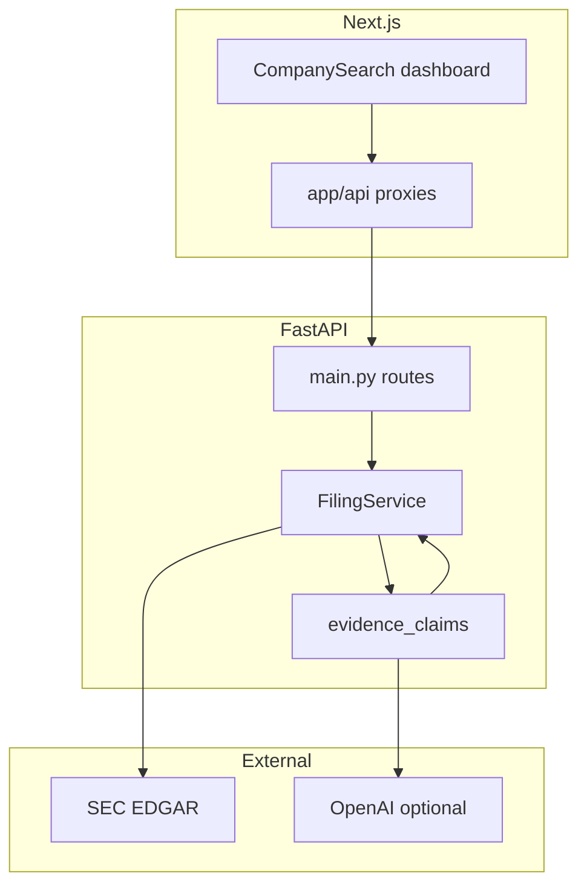

# AlphaLens Architecture

AlphaLens is a two-layer SEC filing research system: **deterministic evidence preparation** plus **schema-constrained LLM judgment** with post-hoc validation.

## System overview

## Layer 1 — Evidence preparation (deterministic)

Implemented primarily in [`backend/app/services/filing_service.py`](../backend/app/services/filing_service.py).

| Step | Description |
|------|-------------|
| Ingest | Fetch latest 10-K/10-Q HTML from SEC EDGAR |
| Parse | Strip tags, extract Items 1, 1A, 7, 8, 9A |
| Chunk | ~95-word chunks per section |
| Embed | Local hash embeddings by default; optional OpenAI embeddings at ingest |
| Retrieve | Vector-ranked excerpts with boilerplate down-ranking |
| Compare | Term-frequency deltas between two ingested filings |

Outputs: `FilingCitation[]`, `FilingComparison`, deterministic KPI regex extraction.

**Demo mode:** When `ALPHALENS_DEMO_MODE=1`, filings load from [`backend/app/fixtures/demo_filings/`](../backend/app/fixtures/demo_filings/) (NVDA, AAPL, JPM) without live SEC calls.

**Reviewability split:** Filing comparison logic lives in [`backend/app/services/filing/comparison.py`](../backend/app/services/filing/comparison.py): term emphasis deltas, **sentence-level add/remove/modify**, and **KPI numeric deltas** (Revenue, margin, etc.) from Item 7/8 text. Shared retrieval tokenization is in [`retrieval.py`](../backend/app/services/filing/retrieval.py). The main orchestrator remains [`filing_service.py`](../backend/app/services/filing_service.py).

**Comparison output (`section-diff-kpi-v2`):** Each section includes word-count delta, term tags, sentence changes, and side-by-side citations. Filing-level `kpi_deltas[]` summarizes metric movement between periods.

**Validated comparison claims (Phase B):** After diffing, [`comparison_claims.py`](../backend/app/services/filing/comparison_claims.py) builds `comparison_delta` claims from KPI deltas, term shifts, and sentence add/modify signals. `ComparisonClaimValidator` grounds each claim on latest (and optional prior) filing excerpts—the same substring/numeric rules as the brief validator. Optional LLM adds claims when `OPENAI_API_KEY` is set (`llm-validated-comparison-claims`). Results are returned on `GET/POST /filings/compare` as `validated_comparison_claims[]` and persisted on the latest filing JSON when not in demo mode.

**Material changes summary (Phase C / product polish):** Ranked validated claims drive `top_material_changes[]` and a 2–3 sentence `material_changes_summary` (`deterministic-material-changes`, or `llm-material-changes` when the API key is set). Regenerating the investor brief merges stored `comparison_delta` claims into the brief validator path when section citations align.

## Layer 2 — Claim extraction and validation

Implemented in [`backend/app/services/evidence_claims.py`](../backend/app/services/evidence_claims.py).

### Investor brief pipeline

1. **ClaimExtractor** (LLM, JSON schema) — `business_snapshot` + `claims[]` over retrieved citations.
2. **ClaimValidator** (deterministic) — rejects claims when:
   - `evidence_citation` is out of range
   - `verbatim_span` / `claim` is not grounded in the excerpt
   - Numeric values in the claim are absent from the excerpt
   - Text matches known SEC boilerplate patterns
3. **BriefAssembler** — maps validated claims to bull / bear / watch (falsifiers) / red flags.
4. **Persist** — `validated_claims` saved alongside the filing JSON for Q&A reuse.

`synthesis_method` values:

- `llm-validated-claims` — happy path
- `degraded-deterministic` — no API key, LLM failure, or zero validated claims

### Q&A pipeline

1. Retrieve citations for the question (deterministic).
2. Load **cached validated claims** for the ingested filing.
3. **QuestionClaimAnswerer** ranks claims by question terms; optional LLM JSON answer over claims + citations.
4. Fallback: legacy structured synthesis from excerpts only.

## API surface

See FastAPI OpenAPI at `http://localhost:8000/docs` when the backend is running.

| Endpoint | Role |
|----------|------|
| `GET /health` | Liveness, `demo_mode`, `llm_judgment` flags |
| `POST /company/{ticker}/filings/latest` | Ingest (or load demo filing) |
| `GET /company/{ticker}/filings/latest/brief` | Investor brief |
| `POST /company/{ticker}/filings/latest/questions` | Cited Q&A |
| `GET/POST /company/{ticker}/filings/compare` | Period comparison |

## Frontend

- [`frontend/components/company-search.tsx`](../frontend/components/company-search.tsx) — main dashboard (being split into `components/brief/*`).
- [`frontend/lib/api.ts`](../frontend/lib/api.ts) — typed client mirroring Pydantic models.
- BFF routes under `frontend/app/api/company/[ticker]/` proxy to the backend; secrets stay server-side.

## Configuration

| Variable | Purpose |
|----------|---------|
| `SEC_USER_AGENT` | Required for live SEC ingest |
| `OPENAI_API_KEY` | Enables LLM judgment when set |
| `ALPHALENS_LLM_SYNTHESIS=0` | Opt out of LLM while keeping the key |
| `ALPHALENS_DEMO_MODE=1` | Fixture filings only |
| `ALPHALENS_API_BASE_URL` | Backend URL for Next.js server |

Load order: repo root `.env` via [`backend/app/config.py`](../backend/app/config.py) on startup.

## Failure modes

| Condition | Behavior |
|-----------|----------|
| No OpenAI key | Degraded heuristic brief; excerpt-based Q&A |
| LLM returns ungrounded claims | Validator drops them; may fall back to degraded brief |
| No validated claims cached | Q&A uses legacy excerpt synthesis |
| Demo mode + unsupported ticker | 404 with supported ticker list |

## Testing strategy

- Unit tests: validator, assembler, filing parsers
- API tests: `TestClient` smoke on routes
- Eval fixtures: structural rubric on brief outputs ([`backend/tests/eval/`](../backend/tests/eval/))
- CI: pytest + ruff + frontend lint/typecheck/build

## Intentional limitations

- Not investment advice; filing-grounded research aid only.
- Local filesystem persistence (not cloud-native without object storage).
- No authentication or multi-tenant isolation in v0.1.
